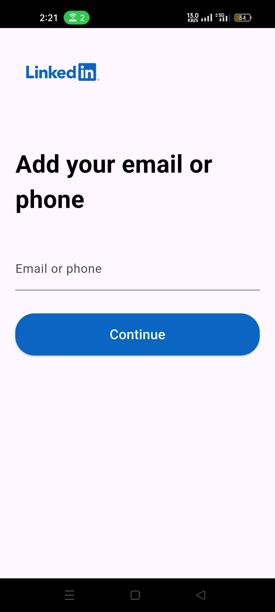

# Minimal LinkedIn UI

This project is a minimalistic LinkedIn-like application built using Flutter. It features a very appealing UI and includes various screens such as Home, Login, and Sign Up. The primary focus of this project is to showcase a beautiful and responsive user interface.

## Screenshots

Here are some screenshots of the application:

  
  
  
  
  
  
  
  

